---
# You can also start simply with 'default'
theme: default
# random image from a curated Unsplash collection by Anthony
# like them? see https://unsplash.com/collections/94734566/slidev
# background: https://cover.sli.dev
background: https://cdn.jsdelivr.net/gh/slidevjs/slidev-covers@main/static/_eObctVlXn4.webp
# some information about your slides (markdown enabled)
title: Quickdraws
# info: |
#   ## Slidev Starter Template
#   Presentation slides for developers.

#   Learn more at [Sli.dev](https://sli.dev)
# # apply unocss classes to the current slide
class: text-center
# # https://sli.dev/features/drawing
# drawings:
#   persist: false
# # slide transition: https://sli.dev/guide/animations.html#slide-transitions
transition: fade
# # enable MDC Syntax: https://sli.dev/features/mdc
# mdc: true
---

<h1 class="!text-5xl/16">A scalable variational inference approach for increased mixed-model association power(2025)  --Nature Genetics</h1>

Yang Chen  March 12, 2025

<!-- 
09 January 2025 Nature Genetics
 -->

  Quickdraws <carbon:arrow-right />

  <!-- <button @click="$slidev.nav.openInEditor" title="Open in Editor" class="slidev-icon-btn">
    <carbon:edit />
  </button> -->
  <a href="https://github.com/PalamaraLab/quickdraws" target="_blank" class="slidev-icon-btn">
    <carbon:logo-github />
  </a>

---

## Table of contents

- Overview of the Quickdraws algorithm
  - Step 1: Model Fitting
  - Step 2: Testing
- Performance in simulated data
  - Statistical power
  - Calibration and statistical robustness 
- UK Biobank analysis
- Computational costs
- Performance optimization
- Summary of the Quickdraws algorithm
- Discussion

---

## Summary of the Quickdraws algorithm

```mermaid
flowchart LR
    classDef font-large font-size:20px;

    A((Start)) --> B["Data Preparation: Quality Control, Odd/Even Chromosome Setup, PCA (Top 10 PCs)"]
    B --> C{Step 1: Model Fitting}
    C -->|Bayesian Regression| C1["Spike-and-Slab Prior Linear (Quant) Logistic (Binary)"]
    C -->|Variance Components| C2["RHE for Quantitative, Grid Search h² for Binary, LOCO Scheme"]
    C -->|Stochastic Variational Inference| C3["(Optimize ELBO Posterior Estimation)"]
    C --> D{Step 2: Statistical Testing}
    D -->|Score-based Test| D1["Approx. Firth for Binary, Parallel Optimization"]
    D --> E["Results Evaluation"]
    E -->|Statistical Power| E1["Compare Mean χ², Gains in Low Polygenicity, Effective Sample Size"]
    E -->|Statistical Robustness| E2["Even Chromosomes for Non-causal, PCA Covariates, Check Pop. Stratification"]
    E -->|Comparison to Other Methods| E3["REGENIE, FastGWA, SAIGE, BOLT-LMM"]
    E --> F((End))

    A:::font-large
    B:::font-large
    C:::font-large
    C1:::font-large
    C2:::font-large
    C3:::font-large
    D:::font-large
    D1:::font-large
    E:::font-large
    E1:::font-large
    E2:::font-large
    E3:::font-large
    F:::font-large
```

---

## What problem does it solve?

- 📝 **BOLT-LMM** - uses a Bayesian mixture prior to provide state-of-the-art association power but is computationally demanding, especially for multiple traits, and has limited applicability to binary traits
- 🎨 **SAIGE, FastGWA** - rely on **modeling approximations**, such as sparse genetic matrices, which account only for close genetic relationships.
- 🧑‍💻 **REGENIE** - rely on modeling approximations, such as **block-wise ridge regression**, which assumes that genetic effects are normally distributed.
- 🛠 **Current GWAS methods** - either highly scalable and resource efficient or highly powered, but not both.

<v-click>

- 📤 **Quickdraws** - uses machine learning to simultaneously achieve state-of-the-art association power and computational efficiency for both quantitative and binary traits. Quickdraws uses a Bayesian regression model with **a spike-and-slab prior** on variant effects, efficiently trained using **stochastic variational inference, transfer learning and graphics processing unit (GPU)** matrix operations.

</v-click>

---

## Linear mixed Model

**Linear mixed models (LMMs)** extend linear models to analyze non-independent data, particularly useful in genomic data analysis involving population structure or cryptic relatedness.

$$ y = x_{test}\beta_{test} + \alpha C + g + \epsilon $$

- The genetic and environmental effects are modeled as:
$$
\begin{align*}
g &= \beta_{GRM} X_{GRM} \\
\epsilon &\sim \mathcal{N}(0, \sigma_e^2)
\end{align*}
$$
where $X_{GRM}$ is the standardized genotype matrix and $\sigma_e^2$ is the environmental variance.

**Genetic Relatedness Matrix**

The random genetic effect $g$ can be considered as a **sample** from $\mathcal{N}(0, \sigma_g^2 K)$, where:
$$ K = \frac{1}{M} X_{GRM} X_{GRM}^T $$

- Where $ K $ is the genetic relatedness matrix (GRM) 

---

## Step 1: Model Fitting - Bayesian Regression Overview

<v-switch>

<template #0>

- In the model fitting step, Quickdraws first estimates **genetic and environmental variance components，$\sigma_g^2$，$\sigma_e^2$**.

- **Bayesian regression:**
  - The fitting is performed using Bayesian regression, where genetic effects are modeled with a **spike-and-slab prior**, increasing association power.
  - Use a mixture of Gaussian prior on variant effects to model *nonpolygenic trait architectures*.

</template>

<template #1>

- **Variational Inference in Bayesian Models**

Variational inference is a technique used to **approximate posterior distributions** when exact inference is computationally intractable. It formulates posterior inference as an **optimization problem**.

The Kullback-Leibler (KL) divergence between the approximate posterior $q_{\omega}(\theta)$ and the true posterior $ P(\theta \mid X) $ is given by:

$$
KL\left(q_{\omega}(\theta) \| P(\theta \mid X)\right) = \int q_{\omega}(\theta) \log \left( \frac{q_{\omega}(\theta)}{P(\theta \mid X)} \right) d\theta
$$
The goal of variational inference is to find the parameters $ \omega^* $ that minimize this KL divergence:
$$
\omega^* = \argmin_{\omega} KL\left(q_{\omega}(\theta) \| P(\theta \mid X)\right)
$$

</template>

<template #2>

- **Evidence Lower Bound (ELBO)**

Since directly minimizing the KL divergence is often intractable, variational inference instead **maximizes the Evidence Lower Bound (ELBO)**:

$$
\log(P(X)) \geq \mathbb{E}\left[\log(P(X \mid \theta)\right] - KL\left(q_{\omega}(\theta) \| P(\theta)\right)
$$
The ELBO $(P(X))$ can be written as:
$$
\mathcal{L}_{VI}(\omega) = \mathbb{E}\left[\log(P(X \mid \theta)\right] - KL\left(q_{\omega}(\theta) \| P(\theta)\right)
$$
In the context of Bayesian regression, the ELBO is:
$$
\mathcal{L}_{VI}(\omega) = \mathbb{E}\left[\log(P(\mathbf{y} \mid \theta, \mathbf{X})\right] - KL\left(q_{\omega}(\theta) \| P(\theta)\right)
$$

</template>

</v-switch>

---

## Step 1: Quantitative Traits Model

<v-switch>

<template #0>
    
- **Bayesian Linear Regression Model:**
  
  Likelihood : $P(\mathbf{y} | X, \boldsymbol{\beta}) \sim \mathcal{N}(X\boldsymbol{\beta}, \sigma_e^2)$

  Prior : $P(\boldsymbol{\beta}) = \prod_j P(\beta_j), \quad P(\beta_j) \sim (1 - p_0)\mathcal{N}(0, \sigma^2) + p_0\delta(0)$

  Approximate posterior : $q(\boldsymbol{\beta}) = \prod_j q(\beta_j), \quad q(\beta_j) \sim (1 - \psi_j)\mathcal{N}(\mu_j, \sigma_j^2) + \psi_j\delta(0)$

  - The spike-and-slab prior was recently shown to be *conjugated* to the normal likelihood

</template>

<template #1>

- **Evidence Lower Bound (ELBO) Optimization:**

  $$
  L_{\text{VI}}^{Q}(\boldsymbol{\psi}, \boldsymbol{\mu}, \sigma) \approx -\frac{1}{B} \sum_{b=1}^B \left( \sum_{s=1}^S \frac{(\mathbf{y}_b - X_b \boldsymbol{\beta}(s))^2}{2\sigma_e^2} \right)
  $$

  $$
  + \frac{1}{B} \sum_{j=1}^M \left( \frac{\psi_j}{2} \left( -1 + \frac{\mu_j^2 + \sigma_j^2}{\sigma^2} - \log \frac{\sigma_j^2}{\sigma^2} \right) + (1 - \psi_j) \log \frac{1 - \psi_j}{1 - p_0} + \psi_j \log \frac{\psi_j}{p_0} \right).
  $$

  where $\beta(s)$ are effect estimates sampled from the approximate posterior distribution $q(\beta)$, and $\psi_j$, $\mu_j$, $\sigma_j$ are variational parameters.

**Optimization Approach**
To reduce the variance of this objective function and accelerate convergence, we employ:
- **Local reparameterization trick**: This technique helps in *decreasing the variance of gradient estimates*.
- **Antithetic variates**: By generating pairs of negatively correlated random samples, this method further reduces variance.

</template>

</v-switch>

---

## Step 1: Binary Traits Model

<v-switch>

<template #0>

- **Bayesian Logistic Regression Model:**

Likelihood : $P(\mathbf{y} | X, \boldsymbol{\beta}) = \prod_{n=1}^N c_n^{y_n} \{1 - c_n\}^{1 - y_n}, \quad c_n = \sigma(\mathbf{X}_n \boldsymbol{\beta})$

Where，**Sigmoid Function** $\sigma(\cdot)$, which maps the regression output to a probability value between 0 and 1.

**Prior and Approximate Posterior**:
   - **Prior**: Remains unchanged from earlier definitions.
   - **Approximate Posterior**: Assumed to follow a **spike-and-slab distribution**. 
     - Though not conjugate to the logistic likelihood, empirical observations indicate it provides a reasonable approximation to the true posterior.

</template>

<template #1>

- **Evidence Lower Bound (ELBO) for Binary Traits:**
  $$
  L_{\text{VI}}^{\text{Bi}}(\boldsymbol{\psi}, \boldsymbol{\mu}, \sigma) \approx -\frac{1}{B} \sum_{b=1}^B \left( \sum_{s=1}^S \mathbf{y}_b \log(\sigma(X_b \boldsymbol{\beta}(s))) + (1 - \mathbf{y}_b) \log(1 - \sigma(X_b \boldsymbol{\beta}(s))) \right)
  $$

  $$
  + \frac{1}{B} \sum_{j=1}^M \left( \frac{\psi_j}{2} \left( -1 + \frac{\mu_j^2 + \sigma_j^2}{\sigma^2} - \log \frac{\sigma_j^2}{\sigma^2} \right) + (1 - \psi_j) \log \frac{1 - \psi_j}{1 - p_0} + \psi_j \log \frac{\psi_j}{p_0} \right),
  $$

- **Optimization Method**: 
  - Optimized using **stochastic variational inference (SVI)**.
  - Enables scalable parameter updates via mini-batch sampling and gradient-based methods.

</template>

</v-switch>

---

## variance components

- **Genetic and environmental variance components:**
  - For quantitative traits, Quickdraws estimates genetic and environmental variance components using **randomized Haseman-Elston regression (RHE)**，allows the simultaneous estimation of variance components for **multiple traits**.
  - For binary traits，Quickdraws performed **a grid search** over a set of heritability values, $h^2 \in \{0.01, 0.25, 0.5, 0.75\}$,running the Bayesian regression for each value and selecting the heritability corresponding to the highest likelihood.

- **A leave-one-chromosome-out (LOCO) scheme is used for phenotype prediction**: Due to **Proximal Contamination**, Construct $X_{\text{GRM}}$ using **all variants except those on the same chromosome** as the test variant.

- **Comparison to other methods:**
  - Similar to BOLT-LMM, Quickdraws uses a Gaussian prior for variant effects but focuses on **nonpolygenic trait** architectures by using a spike-and-slab prior. Other scalable methods like REGENIE and FastGWA rely on fully polygenic trait assumptions.

---

## Step 2: Testing - Overview

<v-switch>

<template #0>

- **Score-Based Test Statistic:**
  - After estimating genetic effects, Quickdraws computes a score-based test statistic using a linear or logistic mixed model
  - The test statistic is **approximated by a constant**
  - The constant is estimated by matching the scaled effective sample size

</template>

<template #1>

### Quantitative Traits Testing Model

$$
\mathbf{y} = C\boldsymbol{\alpha} + \mathbf{x}_{\text{test}}\beta_{\text{test}} + g + \epsilon,
$$

The goal is to compute the $\chi^2$ association statistic:

$$
\frac{\left(\mathbf{x}_{\text{test}}^T\hat{V}^{-1}\mathbf{y}\right)^2}{\mathbf{x}_{\text{test}}^T\hat{V}^{-1}\mathbf{x}_{\text{test}}} \sim \chi^2_1.
$$

Where $\hat{V}$ is the estimated variance matrix, $X_{GRM}$ is the genotype matrix used for model fitting, defined as:
$$
\hat{V} = \frac{\hat{\sigma}_g^2}{M} X_{GRM} X_{GRM}^T + \hat{\sigma}_e^2 I_N
$$

To reduce computational costs, according to **GRAMMAR-Gamma**, we approximate the test statistic using the residual phenotype $\tilde{\mathbf{y}}_{\text{LOCO}}$ from Bayesian regression:

$$
\chi^2_Q \propto \frac{(\mathbf{x}_{\text{test}}^T\tilde{\mathbf{y}}_{\text{LOCO}})^2}{\mathbf{x}_{\text{test}}^T\mathbf{x}_{\text{test}}}.
$$

</template>

<template #2>

### Binary Traits Testing Model

$$
\text{logit}(p_i) = C\boldsymbol{\alpha} + \mathbf{x}_{\text{test}}\beta_{\text{test}} + g + \epsilon,
$$

where $p_i = P(y_i = 1 | \mathbf{x}_{\text{test}}, g, C)$ is the probability of the $i$th individual being a case. The score test statistic for $H_0: \beta_{\text{test}} = 0$ is:

$$
T = \frac{\mathbf{x}_{\text{test}}^T(\mathbf{y} - \hat{\mathbf{p}})}{\sqrt{\mathbf{x}_{\text{test}}^T\hat{\rho}\mathbf{x}_{\text{test}}}},
$$

with $\hat{\rho} = \hat{V}^{-1} - \hat{V}^{-1}C(C^T\hat{V}^{-1}C)^{-1}C^T\hat{V}^{-1}$, $\hat{V} = \frac{\hat{\sigma}_g^2}{M}X_{\text{GRM}}X_{\text{GRM}}^T + \hat{W}^{-1}$, and $\hat{W} = \text{diag}\{\hat{p}(1 - \hat{p})\}$. This can be approximated as:

$$
T_B \propto \frac{\mathbf{x}_{\text{test}}^T(\mathbf{y} - \hat{\mathbf{p}})}{\sqrt{\mathbf{x}_{\text{test}}^T\hat{W}\mathbf{x}_{\text{test}}}}.
$$

</template>

<template #3>

### Calibration of Test Statistics

Calibrate the summary statistics by estimating the effective sample size (ESS) increase compared to running linear regression on a homogeneous subset of unrelated individuals. This involves:

1. **Estimating ESS Increase**: Linked to the use of non-infinitesimal Bayesian linear regression ($\gamma_{blr}$).
2. **Estimating ESS Reduction**: Due to the presence of close relatives ($\gamma_{rel}$).

The correction term $c$ is computed as:
$$
c = \frac{\gamma_{rel} \gamma_{blr} \frac{N_{gd}}{N_{lr}} \left( \langle \chi_{lr}^2 \rangle - 1 \right) + 1}{\langle \chi_{qd}^2 \rangle}
$$

**Variables Explanation**
- $\langle \chi_{qd}^2 \rangle$: Mean $\chi^2$ test statistic from Quickdraws.
- $\langle \chi_{lr}^2 \rangle$: Mean $\chi^2$ test statistic from linear/logistic regression on a homogeneous unrelated subset.
- $\frac{N_{gd}}{N_{lr}}$: Ratio of total samples to the number of homogeneous unrelated samples used for linear regression.
- $\gamma_{rel}$ and $\gamma_{blr}$: Correction terms for relatedness and Bayesian linear regression usage, respectively.

</template>

<template #4>

### Testing Optimizations

- **Adjustment for Case-Control Imbalance:**
  - Quickdraws adjusts for potential instability in score-based test statistics, especially for binary traits
  - Uses **approximate Firth's logistic regression** for rare variants and low-prevalence traits
  - Applied to variants with p-values < 0.05, focusing on rare variants (MAF < 5%) and rare traits (prevalence < 5%)

- **Parallelization and Technical Optimizations:**
  - The calculation of test statistics is optimized using `Numba`
  - Operations are parallelized across **multiple cores** for efficient computation
  - Test statistics calculated by **streaming genotype blocks** for memory efficiency

</template>

<template #5>

### Technical advancements

- **Scalability:**
  - Quickdraws incorporates stochastic variational inference and uses first-order optimizers for **linear scaling with sample size**, whereas methods like BOLT-LMM require $O(N^{1.5})$ computation.
- **GPU Optimization:**
  - By offloading matrix multiplications and gradient evaluations to GPUs, Quickdraws achieves substantial speedups over CPU-based computation.
- **LOCO Acceleration:**
  - Quickdraws accelerates LOCO by initializing effect estimates from the whole-genome model, improving speed without compromising accuracy.

</template>

</v-switch>

---

## Performance in simulated data

To assess the statistical power and robustness of Quickdraws, we performed extensive simulations using 50,000 samples from the UK Biobank dataset, genotyped at 512,828 variants. Among these, 54,568 were rare variants with a minor allele frequency (MAF) between $10^{-4}$ and $10^{-2}$.

<v-switch>

<template #1>

### Simulation details

- **Heritability:** Simulate 50 heritable traits with a narrow-sense heritability of $h^2_g = 0.4$.
- **Polygenicity:** The polygenicity (proportion of variants with non-zero effects) ranged from 0.25% to 10%.
- **MAF-dependent Architecture:** The architecture was parameterized with $\alpha = -0.3$, determining the relationship between MAF and effect sizes.

</template>

<template #2>

### Sample composition

We created three groups of 50,000 samples each, using ancestry and relatedness information:

1. **GB-unrel:** A set of unrelated, self-reported white British individuals.
2. **GB-rel:** A set of white British individuals with more first- to third-degree relatives (3.4&times; more compared to the full UK Biobank subset).
3. **EUR:** A set of 50% British and 50% non-British European individuals with a similar level of relatedness to the full white British subset.

These groups were used to simulate shared environmental components among close relatives and ancestry-based population stratification.

</template>

<template #3>

### Statistical power and robustness

- **Statistical Power:** Simulated **causal variants** were sampled from odd chromosomes to evaluate statistical power.
- **Statistical Robustness:** **Non-causal variants** from even chromosomes were used to assess robustness to population relatedness and stratification.

Principal component analysis (PCA) was performed using the top ten PCs as covariates for Quickdraws and other models.

</template>

</v-switch>

---

## Statistical power

<v-switch>

<template #0>

### Quantitative trait association

Measured statistical power by comparing **average $\chi^2$ test statistics** at simulated causal variants across unrelated white British samples.

- Quickdraws showed higher average $\chi^2$ statistics than other methods, particularly for traits with low polygenicity.
- For traits with 1% polygenicity and 5,000 causal variants, Quickdraws achieved ≥11.46% higher average $\chi^2$ than REGENIE and BOLT-LMM-Inf.
- This resulted in a significant gain in effective sample size.

  

</template>

<template #1>

### Binary trait association

Phenotypes were simulated under **a liability threshold model**, using a default cutoff of p < 0.05, with varying numbers of causal variants.

- Quickdraws outperformed SAIGE, REGENIE, and FastGWA-GLMM in terms of statistical power, particularly for traits with low polygenicity (0.25%).
- For traits with low polygenicity, Quickdraws achieved 11.5% and 12.04% higher average $\chi^2$ compared to REGENIE and FastGWA-GLMM, respectively.

  

</template>

<template #2>

### Testing with non-spike-and-slab distributions

Simulations were also performed with causal effects sampled from **Gaussian, mixture of Gaussians, or Laplace distributions**. In the mixture of Gaussian setting, Quickdraws and BOLT-LMM exhibited higher power than other models. When traits were fully infinitesimal (with Laplace and Gaussian effects), Quickdraws and BOLT-LMM showed results similar to other infinitesimal methods.

- In fully infinitesimal traits, Quickdraws and BOLT-LMM performed similarly to methods assuming infinitesimal trait architecture.

### Power evaluation in large datasets

We evaluated Quickdraws on larger datasets with 405,000 white British individuals and 460,000 European individuals from the UK Biobank.

- Quickdraws exhibited the highest association power, surpassing BOLT-LMM, especially when polygenicity was low.

</template>

</v-switch>

---

## Calibration and statistical robustness of Quickdraws

<v-switch>

<template #0>

### Calibration in quantitative traits

Consider several simulation settings with population structure and relatedness and varying polygenicity of traits from 1% to 10%.

- Quickdraws remained well-calibrated across all simulation settings, while linear regression struggled with relatedness and population structure.
- REGENIE showed inflated test statistics in datasets with high relatedness due to its lack of explicit relatedness accounting.
- Quickdraws had **higher variance in FPR estimates** in simulations with nonhomogeneous ancestry due to noise in the effective sample size.

</template>

<template #1>

### Calibration in binary traits

Vary the prevalence of the trait from **0.3 to 0.001** under varying levels of population structure and relatedness while fixing the polygenicity of the traits to 2%.

- Quickdraws controlled FPRs for both common and rare variants, while methods like BOLT-LMM and REGENIE showed inflation, especially for low-prevalence traits.
- At low prevalence (≤0.01), Quickdraws and REGENIE produced deflated test statistics, but lacked sufficient power to detect associations in most methods.

  

</template>

<template #2>

### Robustness across different conditions

Quickdraws was evaluated across varying **levels of population structure**, relatedness, and causal effect-size distributions.

Valuate FPRs in simulations involving all white British individuals (N ≈ 405,000) and all self-identified European individuals from the UK Biobank (N ≈ 460,000), varying levels of polygenicity in quantitative traits (1–10%) and varying levels of prevalence (0.3–0.001) in binary traits.

- Quickdraws maintained controlled FPRs in all tested conditions, while methods like FastGWA and REGENIE showed inflation in some cases due to residual population stratification.

  

</template>

<template #3>

### Overall results

- **Statistical Power:** Quickdraws outperformed or matched BOLT-LMM for quantitative traits and achieved higher power than existing methods for binary traits.
- **FPR Control:** Quickdraws provided controlled FPRs across all simulated scenarios, including those with population structure, relatedness, and low-prevalence binary traits.

</template>

</v-switch>

---

## UK Biobank analysis

<v-switch>

<template #0>

### Dataset and Analysis Overview

- Apply Quickdraws to 405,000 white British individuals from UK Biobank
  - 79 quantitative traits (blood-related, anthropometric and other traits)
  - 50 self-reported diseases
  - 458,420 markers retained after quality control for model fitting
  - 13.3 million imputed variants tested
- Comparison methods: SAIGE, FastGWA, REGENIE, and BOLT-LMM

</template>

<template #1>

### Number of Independent Associations Detected

- Quickdraws **detected significantly more independent associations** than REGENIE and FastGWA for both quantitative and disease traits (binomial test P < 1.9×10⁻³)
- For quantitative traits:
  - 4.97% more independent associations than REGENIE
  - 22.71% more independent associations than FastGWA
  - Similar to BOLT-LMM (Quickdraws: 26,236, BOLT-LMM: 26,368)
- For disease traits:
  - 3.25% more independent associations than REGENIE
  - 7.07% more independent associations than FastGWA-GLMM
- Larger gains in traits with high estimated heritability or low polygenicity (e.g., 8.04% increase over REGENIE for mean platelet volume and 26.1% increase for standing height)

  

</template>

<template #2>

### Protein Trait Analysis

- We analyzed 250 plasma protein traits (N ≈ 43,000)
  - These traits typically have lower polygenicity
  - Quickdraws identified 5.54% more loci than REGENIE (P = 6.6×10⁻³)
- Effective sample size comparison:
  - 14.7% higher than FastGWA (P = 7.6×10⁻⁴)
  - 3.4% higher than REGENIE (P = 0.197)
  - Similar to BOLT-LMM (P = 0.46)

  

</template>

<template #3>

### Polygenic Prediction Accuracy

- **Evaluating accuracy of non-infinitesimal modeling:**
  - Used predictors from step 1, trained on 405,000 white British individuals to predict traits for remaining samples
  - Mean correlations across 79 quantitative traits:
    - Quickdraws: 0.307 (s.e. = 0.0061)
    - BOLT-LMM: 0.313 (s.e. = 0.0061)
    - BOLT-LMM-Inf: 0.271 (s.e. = 0.0061), notably lower
  - Consistent with previously observed improvements from non-infinitesimal trait architecture modeling
- **Comparison with polygenic scores (PGS) built using recent methods (PRS-CS and P+T):**
  - Quickdraws' step 1 predictors were significantly more accurate in European held-out set (P < 5.6×10⁻⁶)
  - Similar accuracy in other groups

  

</template>

<template #4>

### Replication Analysis Validation

- Replication analysis based on GWAS summary statistics from Biobank Japan, FinnGen, and other large-scale studies
- Across 53 traits (comprising 40 approximately independent traits):
  - Quickdraws yielded a higher number of replicated loci than REGENIE and FastGWA
    - Binomial test P = 0.014 (vs. REGENIE)
    - Binomial test P = 7×10⁻⁴ (vs. FastGWA)
- For 30 quantitative traits:
  - 2.5% more replicated loci than REGENIE
  - 15.72% more replicated loci than FastGWA
  - Similar to BOLT-LMM (Quickdraws: 37,210, BOLT-LMM: 37,072)
- For 23 disease traits:
  - 1.07% more replicated loci than REGENIE
  - 3.38% more replicated loci than FastGWA-GLMM

  

</template>

<template #5>

### Calibration and Functional Annotation

- **Assessed calibration by comparing linkage disequilibrium (LD) score regression attenuation ratios**
  - Quickdraws produced attenuation ratios close to those of linear regression in unrelated British samples
    - Quickdraws: 0.0832 (s.e. = 0.008)
    - Linear regression: 0.0892 (s.e. = 0.008)
  - For low-prevalence binary traits, Quickdraws remained calibrated
    - Did not produce signatures of false-positive associations
- **Evaluated functional annotation of regions with variants found using Quickdraws but not REGENIE**
  - Similar enrichments compared with variants detected using both REGENIE and Quickdraws
  - Indicating no major differences in the functional profile of variants exclusively detected by Quickdraws

  

</template>

</v-switch>

---

## Computational costs

<v-switch>

<template #0>

### Binary Trait Analysis Performance

  
  
  

    <ul class="mt-1">
      <li><strong>Low sample complexity</strong>: Quickdraws shows <strong>linear scaling</strong> with sample size</li>
      <li><strong>Competitive performance</strong>: Similar runtime to REGENIE for large sample sizes</li>
      <li><strong>Balanced approach</strong>: Achieves higher statistical power without excessive computational cost</li>
    </ul>
  

</template>

<template #1>

### Quantitative Trait Analysis Performance

  
  
  

    <ul class="mt-1">
      <li><strong>Multi-trait efficiency</strong>: Quickdraws particularly efficient for multiple traits</li>
      <li><strong>GPU acceleration</strong>: Significant speedups for Bayesian regression step</li>
      <li><strong>Memory-compute tradeoff</strong>: Options for both high-memory (faster) and low-memory (more accessible) modes</li>
    </ul>
  

</template>

<template #2>

### Technical Implementation Details

  

    <h4 class="font-bold">Hardware and Setup</h4>
    <ul class="mt-1">
      <li><strong>Markers:</strong> 458,464 for Quickdraws, REGENIE, and BOLT-LMM; 89,177 for SAIGE</li>
      <li><strong>Hardware:</strong> Tested on UK Biobank RAP with up to four machines</li>
      <li><strong>Quickdraws:</strong> Utilizes <strong>GPU acceleration</strong> for Bayesian regression</li>
    </ul>
  

  
  

    <h4 class="font-bold">Memory Management</h4>
    <ul class="mt-1">
      <li><strong>High-Memory Mode:</strong> Loads genotype matrix in memory</li>
      <li><strong>Low-Memory Mode:</strong> Streams data from disk (20% slower)</li>
      <li><strong>RAM usage:</strong> Scales with MN/4 + GPU memory</li>
      <li><strong>Comparison:</strong> REGENIE/FastGWA &lt;15 GB RAM for 405,000 samples</li>
    </ul>
  

</template>

</v-switch>

---

## Performance optimization

<v-switch>

<template #0>

### Memory Optimization

1. **Raw Genotypes**:  
   Genotype matrix stored as N x M using 2 bits per genotype entry. Encoding done with `np.packbits()` and `np.unpackbits()`, with column-wise mean and variance for standardization.

2. **Genotype Streaming**:  
   Test statistics calculated by streaming genotype blocks instead of loading all variants into memory. Block size based on available memory (default: 32GB), with parallelized data IO.

</template>

<template #1>

### Speed Optimization

1. **GPUs for Bayesian Regression**: Use GPUs with `PyTorch`

2. **Transfer Learning**: LOCO models initialized with effect estimates from whole-genome regression, reducing iterations and speeding up model fitting (2x-2.5x faster).

3. **Numba Optimization**: Vectorized linear regression for multiple traits using Numba's `parallel` and `njit`

4. **Test Statistic Calibration**: Calibration using 458k genotyped variants, reducing runtime and ensuring consistent results with imputed variants.

5. **Data Loading with HDF5 and PySnpTools**: Raw genotypes stored in compressed `HDF5` files, with `PySnpTools` used for efficient variant-wise access to bgen/bed files.

6. **Approximate Firth Logistic Regression**: Applied to variants with p-values < 0.05, focusing on rare variants (MAF < 5%) and rare traits (prevalence < 5%).

7. **Multiple Traits**: Operations vectorized using `Numpy and Numba`, improving parallel computation across multiple traits.

</template>

</v-switch>

---

## Discussion

### Future Work and Limitations

- **GPU Dependency**: Slower on CPU hardware; future work could optimize for CPU performance
- **Cross-trait Correlations**: Current version doesn't capture these; future development could improve performance
- **External Cohort Integration**: Using PGSs from larger external cohorts could enhance power
- **Participation Bias**: Quickdraws is susceptible; need to integrate adjustment strategies into initial steps
- **Meta-analysis Strategies**: Develop methods to combine posterior effect estimates across cohorts for federated analyses
